# LEARN GIT TODAY

## Idenfity the git user global within the device
```
  git config --global user.email "you@example.com"
  git config --global user.name "Your Name"
```

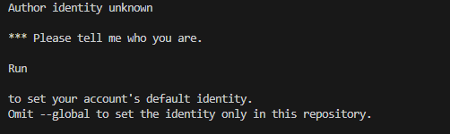

## Initialize github in a folder

```
# initialize git in learn-github folder

git init

```

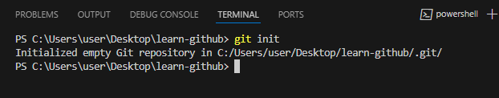

## Get the repository / project / folder git status

```
# git status

git status 
```

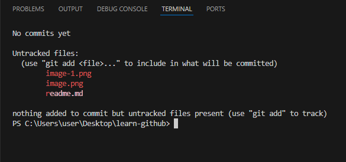

## Track files within a repository / folder using git (git staging)

```
# git add
git add <images/image-1.png>

# to view the added / staged file use
git status

```

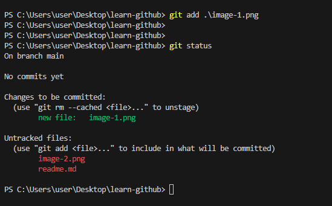

### A screenshot of the github staged / unstaged changes 

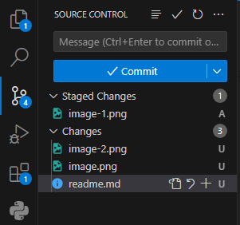

## Staging all files

### To discovery how to stage all files once use:

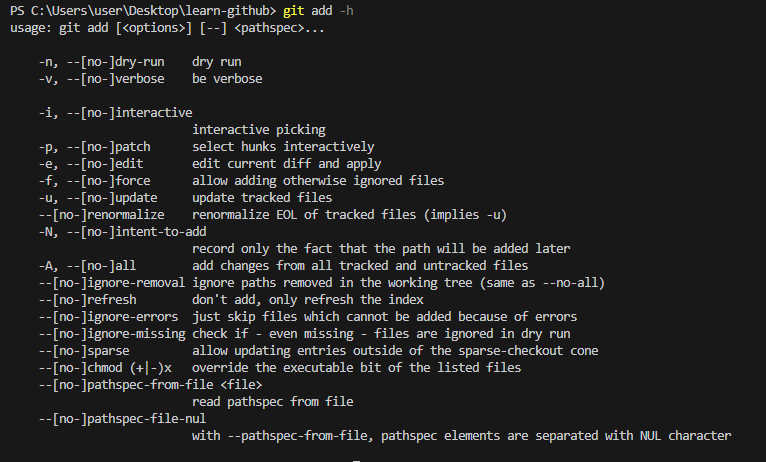

```
# stages all files
git add -A
```

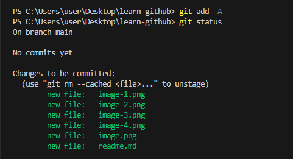

# Commit our changes
```
# commit changes 
-m for commit message
git commit -m "learnt github"
```

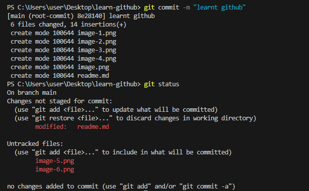

# An Introduction to Github

We go to github.com and create a repository with the name learn-git-today

## A step by step guide for github

- Go to your repositories

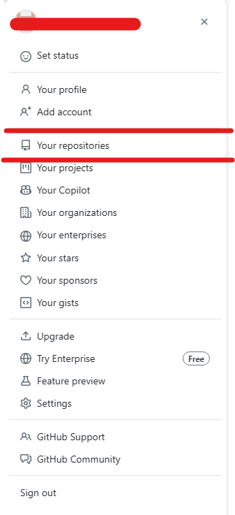

- click on new repository

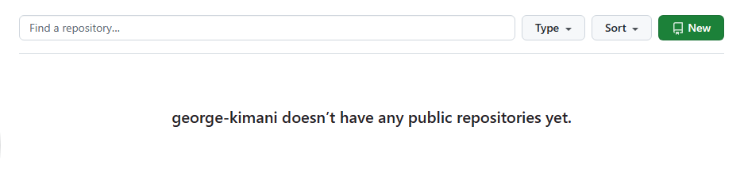

- create the repository

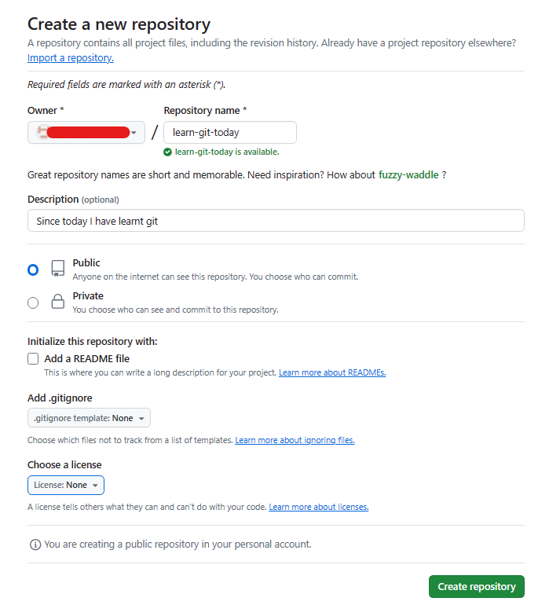

- push the local changes to github (remote)
```
git remote add origin <url>
git push -u origin main
```

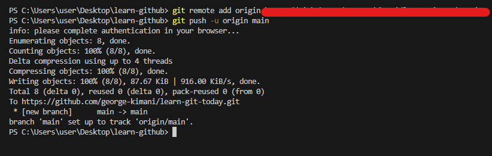

If git (local) hasn't yet been authorized to access github (remote). It shall prompt you for authorization

## Updating the most current version of our repository

We need to stage all files again before commit

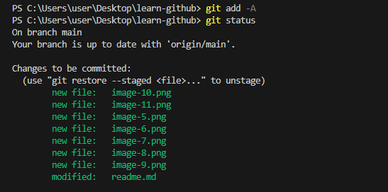

Finally commit all changes

